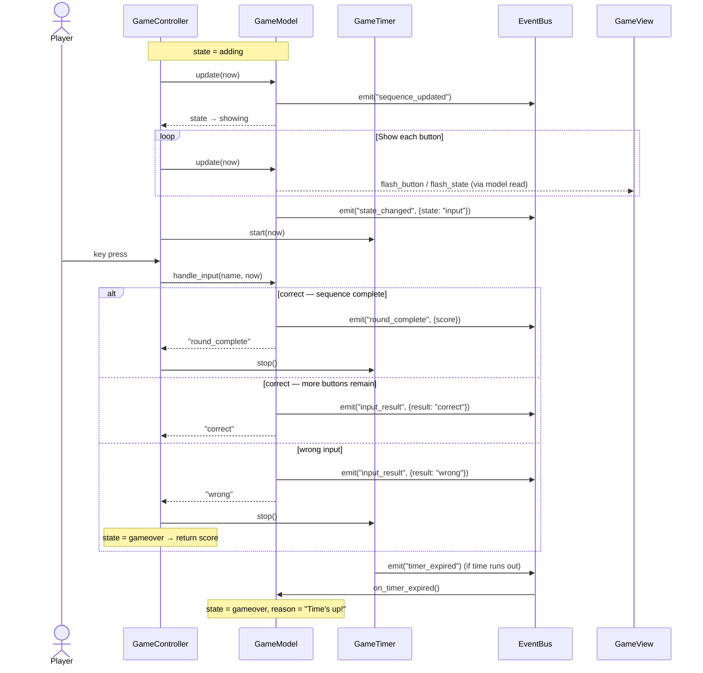
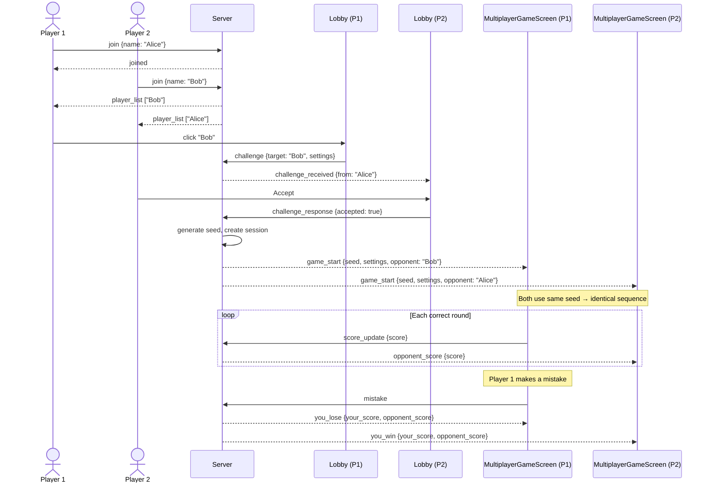

# Typ0

A Simon Says-style memory game built with pygame, playable in the browser via pygbag.

Watch a growing sequence of directional buttons, then reproduce it from memory. One wrong input ends the run. Compete solo for a spot on the top-10 leaderboard, or challenge another player head-to-head in multiplayer.

**Play it now:** [GitHub Pages](https://typ0-swe-spring26.github.io/Typ0/)

---

## Game Modes

| Mode | Description |
|------|-------------|
| **Simon** | Classic sequence memory — watch the pattern, repeat it in order |
| **Bop It** | Faster-paced variant with tighter timing |
| **Multiplayer** | 1v1 online — first player to make a mistake loses |

---

## Controls

### Gameplay
| Action | Default Key |
|--------|-------------|
| Left   | `A` |
| Right  | `D` |
| Up     | `W` |
| Down   | `S` |
| Space  | `Space` |

> Controls can be inverted from the settings menu (swaps WASD directions).

### Game Over Screen (Singleplayer)
| Key | Action |
|-----|--------|
| `R` | Retry |
| `C` | Credits |
| `Q` / `Esc` | Quit |

The game over screen auto-advances to the high scores after 5 seconds.

### Multiplayer Result Screen
| Key | Action |
|-----|--------|
| `Enter` / `R` | Back to lobby |
| `Esc` / `Q` | Main menu |

Auto-returns to the lobby after 12 seconds.

---

## Single-Player Setup

### 1. Create a virtual environment
```powershell
python -m venv venv
```

### 2. Activate the virtual environment

**Windows:**
```powershell
.\venv\Scripts\Activate.ps1
```

If you get an execution policy error:
```powershell
Set-ExecutionPolicy -ExecutionPolicy RemoteSigned -Scope CurrentUser
```

**Mac / Linux:**
```bash
source venv/bin/activate
```

### 3. Install dependencies
```powershell
pip install -r requirements.txt
```

### 4. Run the game
```powershell
python main.py
```

### 5. Deactivate when done
```powershell
deactivate
```

---

## Multiplayer

Multiplayer uses a WebSocket server for matchmaking and a separate HTTP API for online score tracking. Both players receive the same RNG seed so their sequences are identical — the server declares the first player to make a mistake the loser.

### Server setup

The server lives in [`server/`](server/) and has its own dependencies.

```bash
cd server
pip install -r requirements.txt   # websockets, aiohttp
python server.py
```

| Service | Address | Purpose |
|---------|---------|---------|
| WebSocket | `ws://host:14023` | Real-time matchmaking & game events |
| HTTP API  | `http://host:14024` | Score submission and leaderboard |

### Score API

| Method | Endpoint | Description |
|--------|----------|-------------|
| `GET`  | `/scores/{game_type}` | Top 10 scores for a game type |
| `POST` | `/scores/{game_type}` | Submit a score — body: `{"name": "...", "score": 0}` |

Valid `game_type` values: `simon`, `bopit`, `multiplayer`

### Multiplayer flow

1. From the main menu, select **Multiplayer**
2. Enter a name on the **Login** screen and click **Connect**
3. In the **Lobby**, click another player's name to challenge them
4. The challenged player accepts or declines
5. Both players play a synchronized Simon sequence — first mistake loses
6. **Result** screen shows scores and returns to the lobby automatically

---

## Building for Web

**Windows:**
```powershell
build.bat
```

**Mac / Linux:**
```bash
pygbag .
```

This bundles the game for the browser using [pygbag](https://github.com/pygame-web/pygbag). The dev server runs at `http://localhost:8080`.

### GitHub Pages deployment

This repo is connected to GitHub Pages. Every push to `main` triggers the deployment workflow automatically.

---

## Testing

### Unit & BDD tests (no server needed)
```powershell
python run_tests.py          # run all unit tests
python run_tests.py -v       # verbose output
python run_tests.py -x       # stop on first failure
```

### Browser / end-to-end tests
Require a running pygbag server on port 8080:
```powershell
python run_tests.py -m browser
```

BDD feature specs live in [`features/`](features/) and are written with [behave](https://behave.readthedocs.io/).

---

## Project Structure

```
Typ0/
├── main.py                  # Entry point and screen router
├── requirements.txt
├── build.bat                # Windows web build script
├── high_scores.json         # Local singleplayer leaderboard
│
├── game/
│   ├── core/
│   │   ├── game_model.py    # Simon game state machine
│   │   ├── bopit_model.py   # Bop It game state machine
│   │   ├── high_scores.py   # Leaderboard logic (top 10, JSON)
│   │   ├── keybinds.py      # Key mapping + invert mode
│   │   ├── game_timer.py    # Per-round countdown timer
│   │   └── event_bus.py     # Simple pub/sub event system
│   │
│   ├── screens/
│   │   ├── startscreen.py
│   │   ├── startmenu.py
│   │   ├── gameover.py
│   │   ├── high_scores.py
│   │   ├── name_entry.py
│   │   ├── credits.py
│   │   ├── menu.py          # In-game settings overlay
│   │   ├── gameplay/
│   │   │   ├── display.py         # Simon game screen (MVC view)
│   │   │   ├── controller.py
│   │   │   ├── view.py
│   │   │   ├── bopit_display.py   # Bop It game screen
│   │   │   ├── bopit_controller.py
│   │   │   ├── bopit_view.py
│   │   │   └── pause_overlay.py
│   │   └── multiplayer/
│   │       ├── login.py     # Name entry + server connect
│   │       ├── lobby.py     # Player list, challenge/accept/decline
│   │       ├── game.py      # Synchronized multiplayer game screen
│   │       └── result.py    # Win/lose screen
│   │
│   └── utils/
│       ├── scaled_screen.py # Resolution-independent rendering
│       ├── button.py        # Reusable UI button component
│       └── animation_utils.py
│
├── server/
│   ├── server.py            # WebSocket matchmaking + HTTP score API
│   ├── scores.py            # Server-side score persistence
│   └── requirements.txt     # websockets, aiohttp
│
├── features/                # BDD specs (behave)
│   ├── gameplay.feature
│   ├── gameover_flow.feature
│   ├── high_scores.feature
│   ├── pause.feature
│   ├── scoring.feature
│   ├── timer.feature
│   └── steps/
│
└── tests/                   # pytest unit & browser tests
```

---

## Class Diagram

```mermaid
classDiagram

    %% ── Core ───────────────────────────────────────────────────────────
    class EventBus {
        -_listeners : dict
        +subscribe(event, callback)
        +emit(event, data)
    }

    class GameModel {
        +sequence : list
        +player_index : int
        +score : int
        +state : str
        +flash_button : str
        +flash_state : str
        +flash_end : int
        +gameover_reason : str
        +reset()
        +handle_input(name, now) str
        +update(now) bool
        +on_timer_expired(data)
    }

    class BopItModel {
        +sequence : list
        +score : int
        +state : str
        +reset()
        +handle_input(name, now) str
        +update(now) bool
        +on_timer_expired(data)
    }

    class GameTimer {
        +TIME_LIMIT : int
        +fraction : float
        -_active : bool
        -_paused_remaining : int
        +start(now)
        +stop()
        +update(now)
    }

    class KeybindManager {
        +DEFAULT_MAP : dict
        +INVERTED_MAP : dict
        +inverted : bool
        +button_keys : dict
        +key_labels : dict
        +toggle_invert()
    }

    class HighScores {
        <<module>>
        +is_high_score(score) bool
        +add_score(name, score)
        +load_scores() list
    }

    %% ── Singleplayer MVC ───────────────────────────────────────────────
    class GameScreen {
        +model : GameModel
        +view : GameView
        +controller : GameController
        +run() str
    }

    class GameView {
        +button_rects : dict
        +draw(model, timer_fraction)
    }

    class GameController {
        +paused : bool
        +game_timer : GameTimer
        +run() tuple
        -_process_input_result(name, now)
        -_set_paused(paused)
    }

    class BopItScreen {
        +model : BopItModel
        +run() tuple
    }

    %% ── Overlays ───────────────────────────────────────────────────────
    class PauseOverlay {
        +subscribe(bus)
        +draw()
    }

    class MenuOverlay {
        +open : bool
        +active_submenu : str
        +handle_event(event)
        +draw()
    }

    %% ── Multiplayer client ─────────────────────────────────────────────
    class MultiplayerLoginScreen {
        -client
        +name : str
        +run() tuple
    }

    class MultiplayerLobbyScreen {
        -client
        +my_name : str
        +players : list
        +run() tuple
    }

    class MultiplayerGameScreen {
        +model : GameModel
        +view : GameView
        +timer : GameTimer
        +opponent_score : int
        +run() tuple
        -_handle_input(name, now)
        -_draw_multiplayer_hud()
    }

    class MultiplayerResultScreen {
        +won : bool
        +my_score : int
        +opponent_score : int
        +run() str
    }

    %% ── Server ─────────────────────────────────────────────────────────
    class Server {
        <<module>>
        +_players : dict
        +_pending_challenges : dict
        +_sessions : dict
        +handler(websocket)
        +handle_get_scores(request)
        +handle_post_score(request)
    }

    %% ── Utility ────────────────────────────────────────────────────────
    class ScaledScreen {
        +get_width() int
        +get_height() int
        +blit(surface, pos)
        +present()
    }

    %% ── Relationships ──────────────────────────────────────────────────
    GameModel       --> EventBus           : emits/subscribes
    BopItModel      --> EventBus           : emits/subscribes
    GameTimer       --> EventBus           : emits/subscribes

    GameScreen      *-- GameModel
    GameScreen      *-- GameView
    GameScreen      *-- GameController
    GameScreen      *-- EventBus

    GameController  --> GameModel          : updates
    GameController  --> GameView           : draws
    GameController  --> GameTimer          : controls
    GameController  --> KeybindManager     : reads keys
    GameController  --> PauseOverlay       : draws
    GameController  --> MenuOverlay        : draws

    MultiplayerGameScreen *-- GameModel
    MultiplayerGameScreen *-- GameView
    MultiplayerGameScreen *-- GameTimer
    MultiplayerGameScreen *-- EventBus
    MultiplayerGameScreen --> KeybindManager

    GameController  ..> HighScores         : singleplayer scores
    MultiplayerGameScreen ..> Server       : WebSocket msgs
    MultiplayerLobbyScreen ..> Server      : WebSocket msgs
    MultiplayerLoginScreen ..> Server      : WebSocket connect
```



---

## Sequence Diagrams

### Singleplayer round



### Multiplayer match


